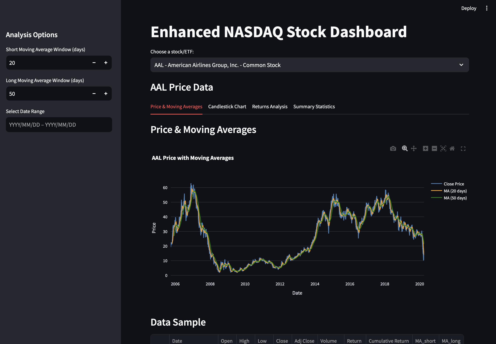
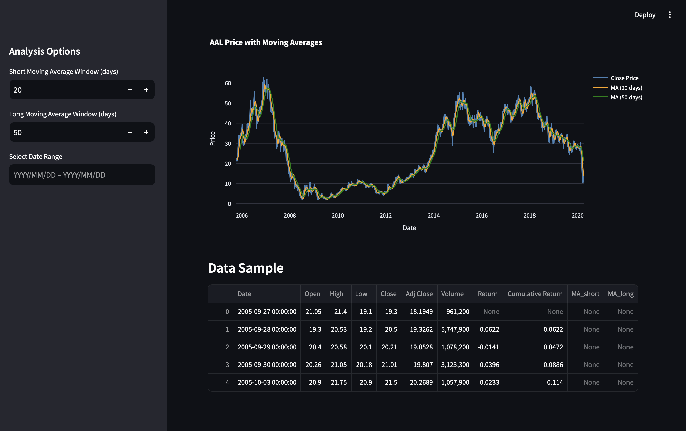
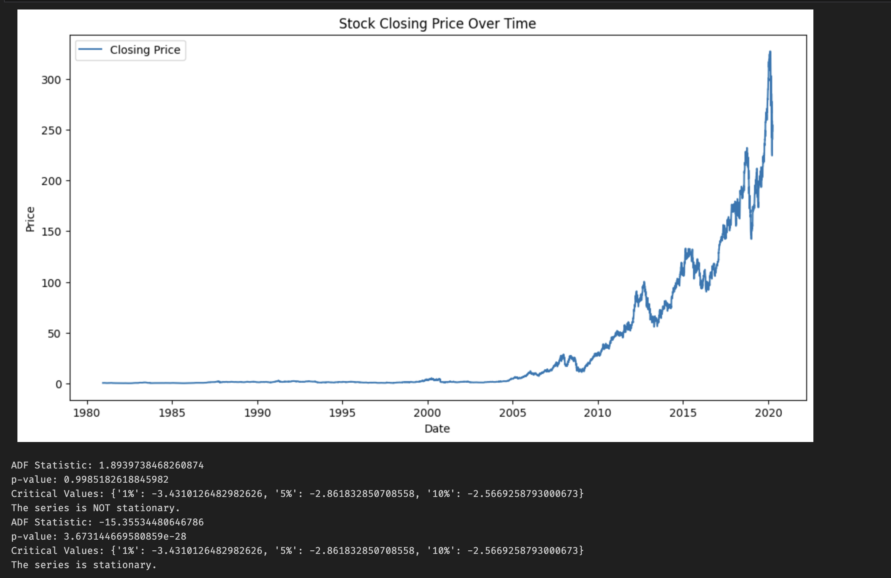
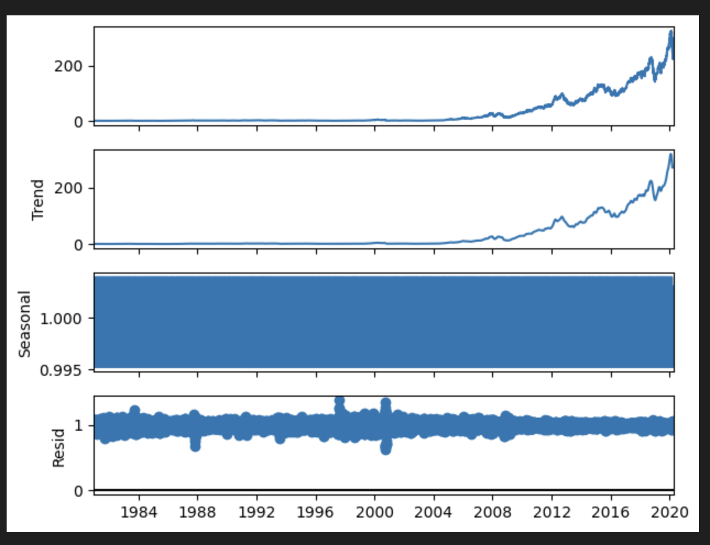
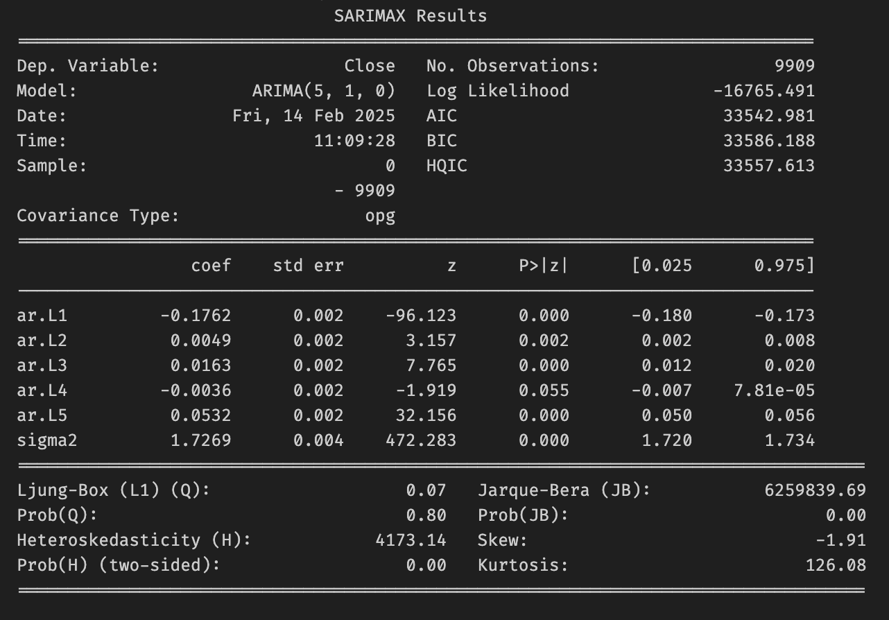

# DataAnalysis

## Project Ideas

### 1. Data Visualization
Create interactive dashboards using Tableau, Power BI, or D3.js to visualize a dataset.
### 2. Time Series Analysis
Analyze and forecast a time series dataset using ARIMA, LSTM, or Prophet.

## Dataset

This dataset contains historical daily prices for all tickers currently trading on NASDAQ. The up to date list is available from nasdaqtrader.com. The historic data is retrieved from Yahoo finance via yfinance python package. It contains prices for up to 01 of April 2020. If you need more up to date data, just fork and re-run data collection script also available from Kaggle.

### Data Structure

The date for every symbol is saved in CSV format with common fields:

- Date - specifies trading date
- Open - opening price
- High - maximum price during the day
- Low - minimum price during the day
- Close - close price adjusted for splits
- Adj Close - adjusted close price adjusted for both dividends and splits.
- Volume - the number of shares that changed hands during a given day.

All that ticker data is then stored in either ETFs or stocks folder, depending on a type. Moreover, each filename is the corresponding ticker symbol. At last, symbols_valid_meta.csv contains some additional metadata for each ticker such as full name.

<a href="https://www.kaggle.com/datasets/jacksoncrow/stock-market-dataset?resource=download">Link for dataset</a>

## Outputs

