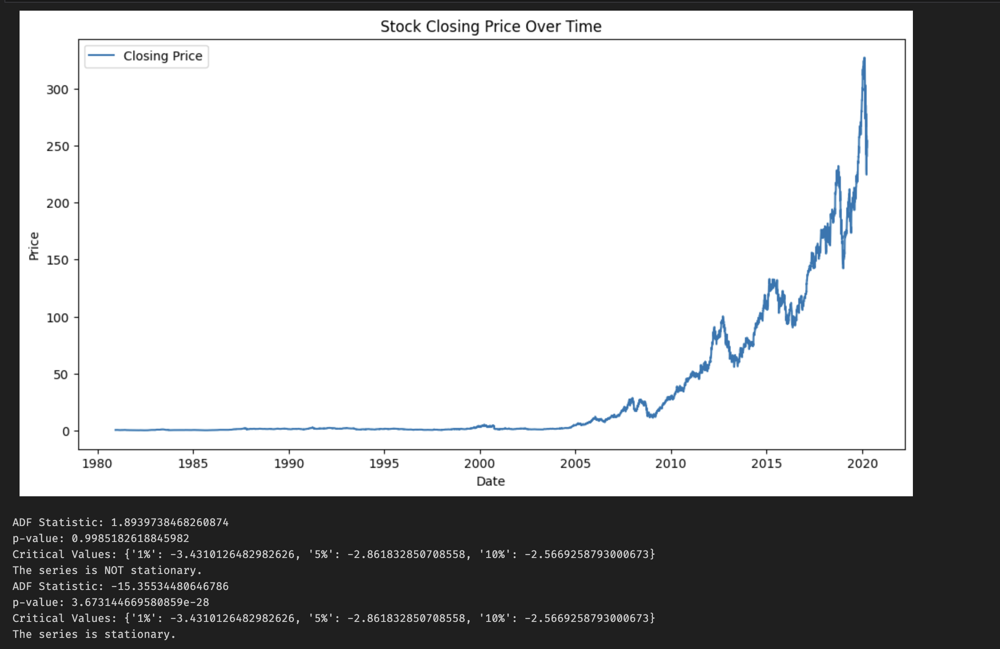
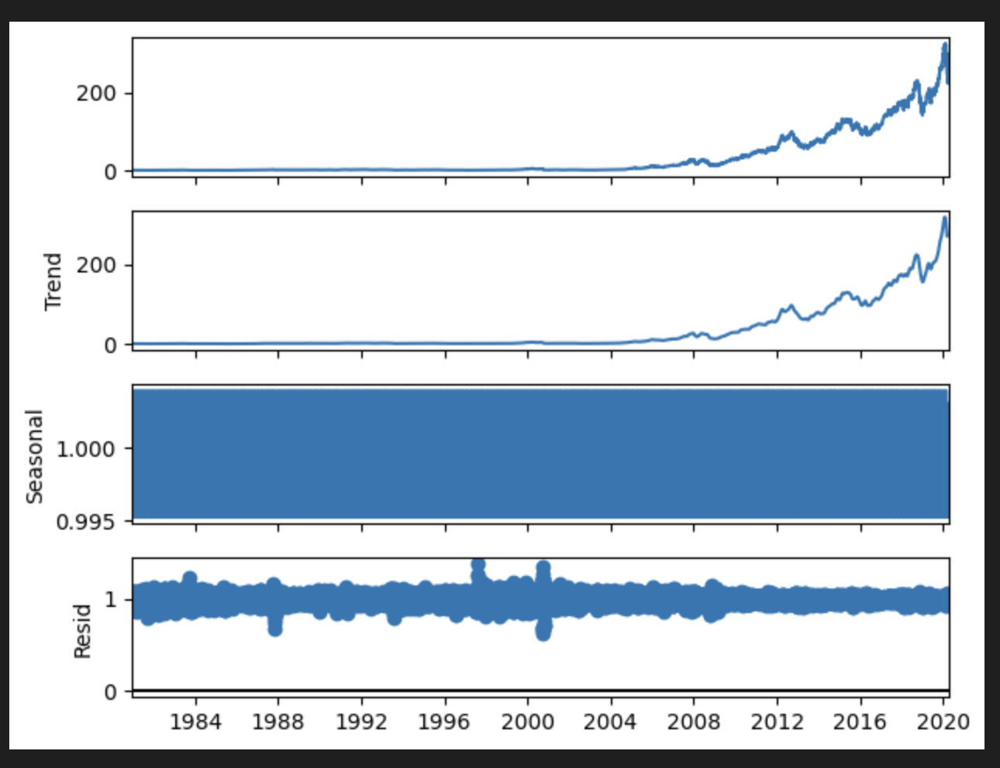
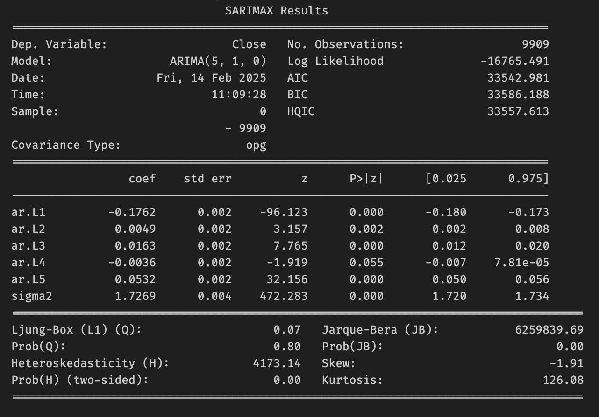

# Time Series Analysis and Forecasting

## Overview
This project focuses on time series analysis and forecasting using historical stock price data. The dataset consists of historical daily closing prices for a selected stock (AAPL). The analysis includes stationarity checks, trend decomposition, and forecasting using ARIMA and SARIMA models.

## Dataset
- **Source**: CSV file containing stock price data
- **Columns Used**: `Date`, `Close`
- **Preprocessing**: The `Date` column is converted to a datetime format and set as the index. Only the `Close` price is used for analysis.

## Steps Performed

### 1. Data Visualization
- The closing price is plotted over time to observe trends and patterns.

### 2. Stationarity Check
- The **Augmented Dickey-Fuller (ADF) test** is used to check if the time series is stationary.
- If the series is not stationary, differencing is applied to remove trends.

### 3. Seasonal Decomposition
- The data is decomposed into **trend, seasonal, and residual components** using the `seasonal_decompose` method.

### 4. ARIMA Model
- An **AutoRegressive Integrated Moving Average (ARIMA)** model is fitted to the data.
- The best order (p,d,q) parameters are determined manually.
- A forecast for the next 30 days is generated and visualized.

### 5. SARIMA Model
- A **Seasonal ARIMA (SARIMA)** model is implemented to account for seasonality.
- The best seasonal order (P,D,Q,s) parameters are selected.
- A 30-day forecast is generated and plotted.

## Results
- The ARIMA and SARIMA models provide different forecasts.
- The SARIMA model accounts for seasonality and may offer better long-term predictions.

## Future Enhancements
- Automate parameter selection using **Auto-ARIMA**.
- Implement **Prophet Model** for forecasting.
- Add real-time stock data integration for live analysis.

## Dependencies
- `pandas`
- `numpy`
- `matplotlib`
- `seaborn`
- `statsmodels`

## Execution
Run the Jupyter notebook to perform analysis and forecasting. Modify parameters as needed for different stocks or datasets.

## Outputs

