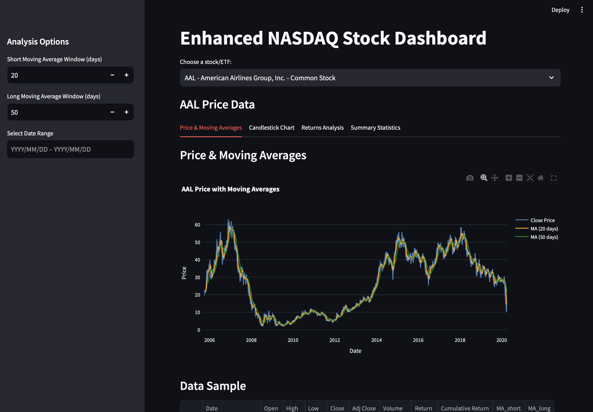

# Dashboard

## D3.JS

To use the D3.JS Dashboard use the following command in the root directory.
```bash
python -m http.server 8000
```
Followed by <a href="http://localhost:8000/dashboard/index.html">http://localhost:8000/dashboard/index.html</a> in your browser 

## Python/ Streamlit

For streamlit version, use the following command:

```bash
DataAnalysis/dashboard streamlit run dashboard.py 
```
### ## Python/ Streamlit Outputs


